# MarkDown语法

弱小和无知不是生存的障碍，傲慢才是

## 标题

~~~标题
一级标题#+空格
~~~

## 字体

~~~字体
加粗**内容**
斜体*内容*
删除线~~内容~~
~~~

## 引用

~~~引用
>+空格
~~~

## 分割线

~~~分割线
---或***
~~~

## 图片

~~~ 图片

~~~

## 超链接

~~~超链接
[超链接名字](链接)
~~~

## 列表

~~~有序列表
数字+.+空格
~~~

~~~无序列表
-+空格
~~~

## 表格

~~~ 表格
名字|性别|生日
--|--|--
张三|男|1999-01-02
查看源码删除空行
~~~

## 代码

~~~代码
`代码`
```或~~~
~~~

## 高亮

~~~高亮
==内容=
~~~

## 思维导图

### 横向思维导图

~~~markdown

~~~

### 纵向思维导图

~~~markdown
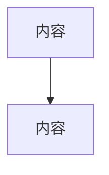
~~~

### 复杂思维导图

````markdown
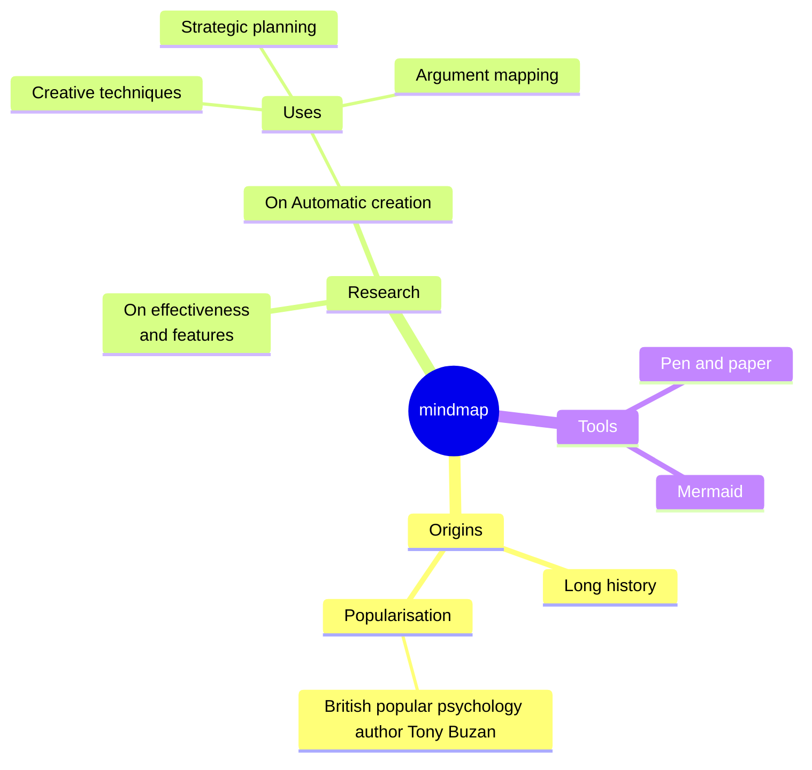
````


## 时序图

````markdown
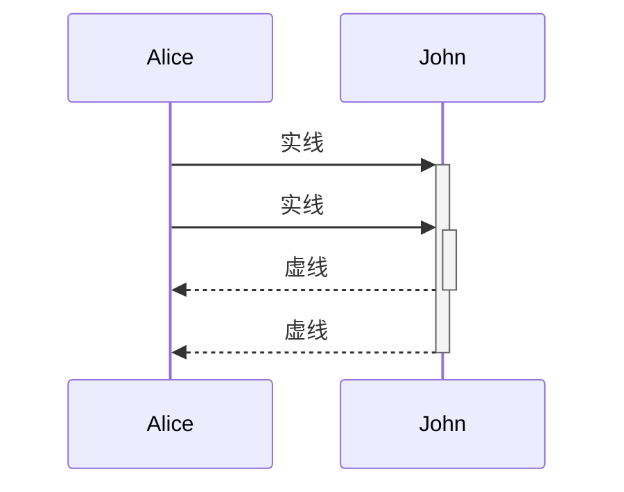
````

## State Diagram(状态图)

````markdown
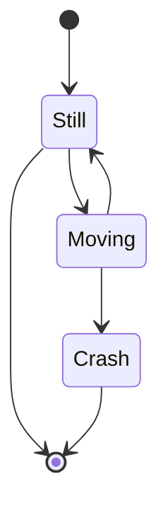
````

## Pie Diagram（饼图）

````markdown
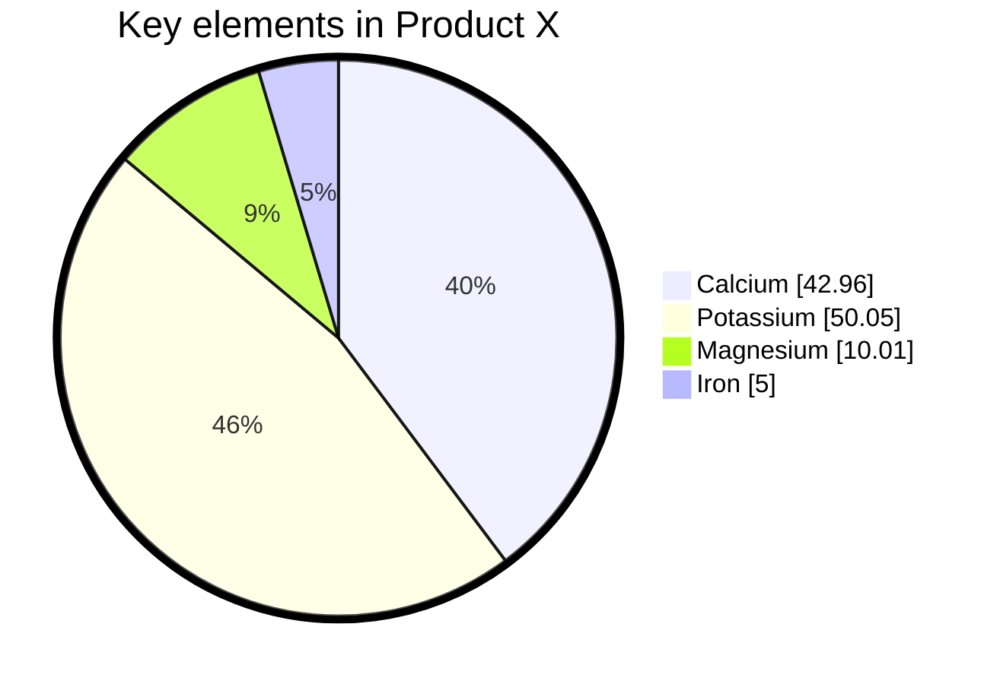
````

## ER图

````markdown
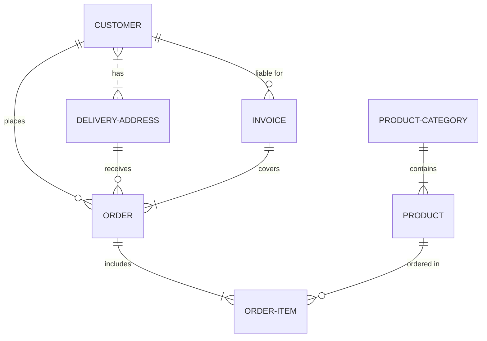
````

## 类图

````markdown
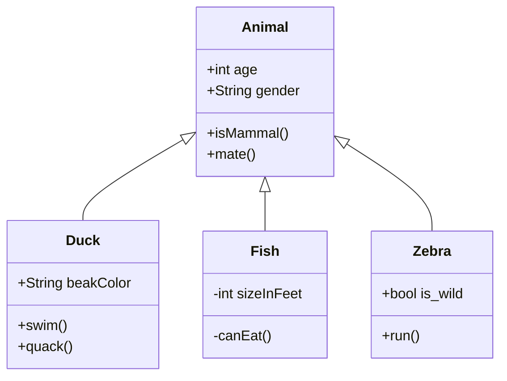
````

## GIT示例图

````markdown
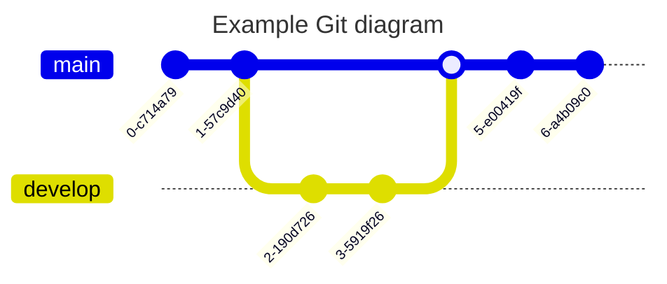
````


## 几种图的写法

### 横向流程图源码格式

````
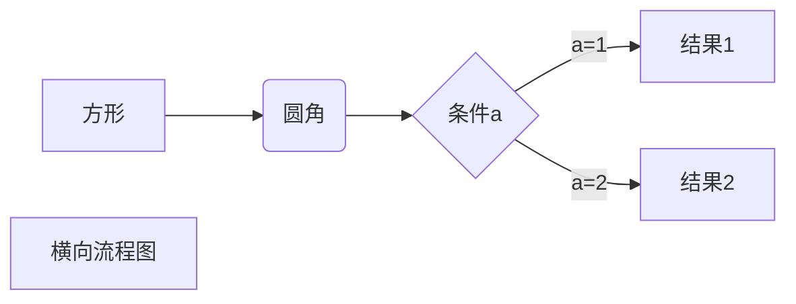
````

### 竖向流程图源码格式


````
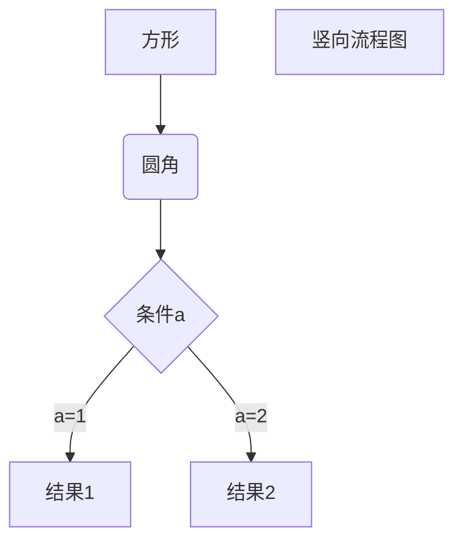
````

### 标准流程图源码格式（纵向）

````
```flow
st=>start: 开始框
op=>operation: 处理框
cond=>condition: 判断框(是或否?)
sub1=>subroutine: 子流程
io=>inputoutput: 输入输出框
e=>end: 结束框
st->op->cond
cond(yes)->io->e
cond(no)->sub1(right)->op
```
````

### 标准流程图源码格式（横向）

````
```flow
st=>start: 开始框
op=>operation: 处理框
cond=>condition: 判断框(是或否?)
sub1=>subroutine: 子流程
io=>inputoutput: 输入输出框
e=>end: 结束框
st(right)->op(right)->cond
cond(yes)->io(bottom)->e
cond(no)->sub1(right)->op
```
````

### UML时序图源码

````
```sequence
sequenceDiagram
对象A->>对象B: 对象B你好吗?（请求）
Note right of 对象B: 对象B的描述
Note left of 对象A: 对象A的描述(提示)
对象B-->>对象A: 我很好(响应)
对象A->>对象B: 你真的好吗？
```
````

### UML时序图源码复杂

````
```sequence
Title: 标题：复杂使用
对象A->对象B: 对象B你好吗?（请求）
Note right of 对象B: 对象B的描述
Note left of 对象A: 对象A的描述(提示)
对象B-->对象A: 我很好(响应)
对象B->小三: 你好吗
小三-->>对象A: 对象B找我了
对象A->对象B: 你真的好吗？
Note over 小三,对象B: 我们是朋友
participant C
Note right of C: 没人陪我玩
```
````

### UML标准时序图样例

````
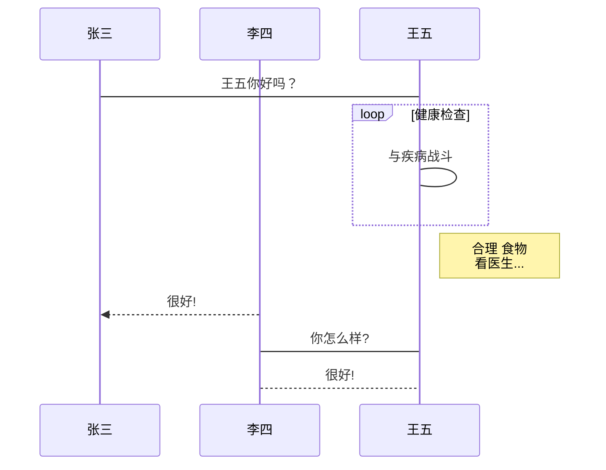
````

### 甘特图

````
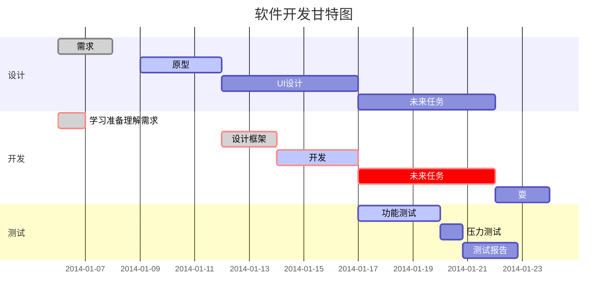
````

## Windows命令

### Windows快捷键

~~~Windows快捷键
Ctrl+C：复制
Ctrl+F4：关闭窗口
Shift+Delete：永久删除
Ctrl+Shift+Esc：打开任务管理器
Win+E：打开我的电脑
~~~

### DOS命令

~~~DOS命令
#盘符切换E：
#查看当前目录下的所有文件dir
#切换目录cd   不同盘符cd /d f:\文件名
#清理屏幕cls
#退出exit
#查看ip  ipconfig
#打开应用
	calc 计算器
	mspaint 画图
	notepad 记事本
	#文件操作
		md 目录名
		rd 目录名
		cd> 文件名
		del 文件名
~~~

## picgo

https://picgo.github.io/PicGo-Core-Doc/zh/guide/getting-started.html

```shell
yarn global add picgo
# or
npm install picgo -g
# 配置文件
picgo set uploader
# 安装插件 https://picgo.github.io/PicGo-Core-Doc/zh/dev-guide/cli.html#%E6%A6%82%E8%BF%B0
npm install ./picgo-plugin-<your-plugin-name>

# 使用插件模板
picgo init plugin <your-project-name>


# 存在npm与picgo-core配置文件的情况下
npx picgo upload xxx.png
# 指定配置文件上传
 picgo upload ./tecoy.cn.png --config C:\Users\fjpti\.picgo\config1.json
```


# Windows注册表快捷方式

```shell
regedit
计算机\HKEY_CLASSES_ROOT\Directory\Background\shell\IntelliJ IDEA\command
默认: "C:\Soft\JetBrains\apps\IDEA-U\ch-0\211.7628.21\bin\idea64.exe" "%V"
Icon: C:\Soft\JetBrains\apps\IDEA-U\ch-0\211.7628.21\bin\idea64.exe

```

